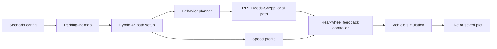
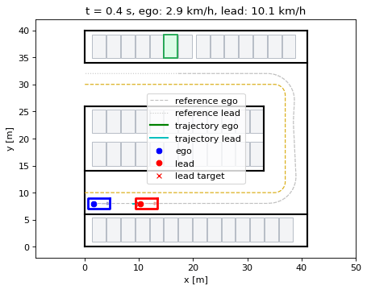
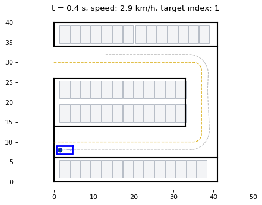
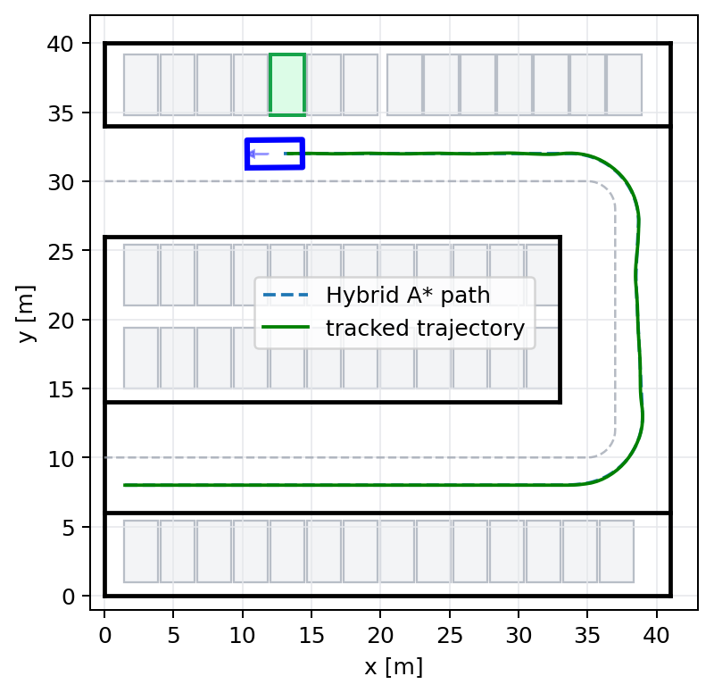
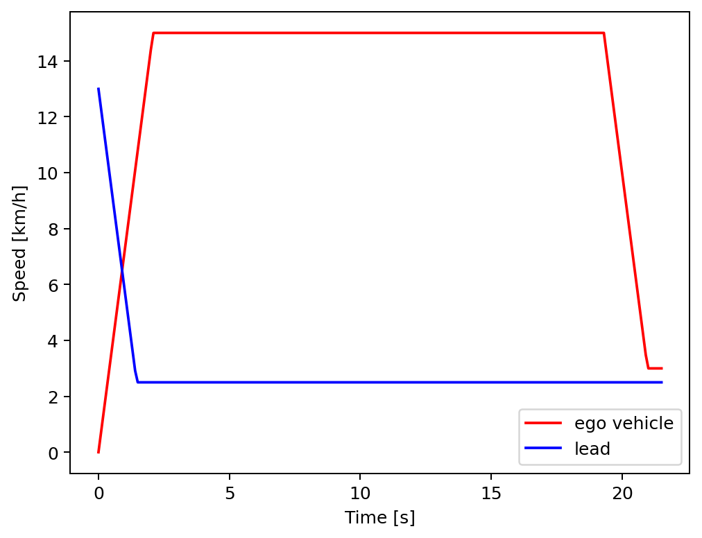

# Behavior-Adaptive Motion Planner for Parking Lots

This repository contains the Python implementation used for Daniel Maksimovski's master's thesis, **Behavior-Adaptive Motion Planning for Automated Driving**.

The project simulates an automated vehicle driving through a structured parking lot. The ego vehicle plans a global path, adapts its speed around a lead vehicle, and performs local RRT Reeds-Shepp lane-change maneuvers when overtaking is required.

## Thesis Context

The thesis presents a behavior and motion planner for automated valet parking, a use case considered promising for early autonomous-driving deployment because parking lots are low-speed, closed, and known environments. The simulated vehicle drives from a starting configuration to an assigned goal configuration while considering static and dynamic obstacles. The final parking maneuver into the bay is not modeled.

The planning approach is based on path-velocity decomposition. Hybrid A* plans global paths through both lanes of the parking lot. A finite-state behavior planner uses distance and velocity metrics to decide whether the ego vehicle should follow the lane, adapt speed behind a lead vehicle, change lanes, or return to the original lane. The velocity planner generates trapezoidal speed profiles, while the local planner uses RRT Reeds-Shepp paths for obstacle-avoidance maneuvers. A decoupled longitudinal and lateral controller tracks the resulting trajectory.

The main objective of the work is motion planning with behavior planning and trajectory planning, where the trajectory is decomposed into path planning and velocity planning. The controller is included to validate the planned trajectories in closed-loop simulation. Its rear-wheel feedback gains have been tuned for smoother tracking in the cleaned repository, but control design is not the main research focus and remains a natural area for future improvement.

## Architecture

The planner follows a path-velocity-control pipeline:

- **Global planning:** Hybrid A* over a parking-lot obstacle map.
- **Behavior planning:** finite-state logic for lane following, lead-vehicle following, lane changes, and return maneuvers.
- **Local planning:** RRT Reeds-Shepp paths for lane-change maneuvers.
- **Velocity planning:** target speed profiles for static, lead-vehicle, and overtaking scenarios.
- **Control:** rear-wheel feedback lateral control and proportional longitudinal speed control.
- **Simulation:** reusable scenario runner, parking-lot map generation, plotting, and path setup helpers.



## Repository Layout

```text
motion_planning/
  global_planning/      Hybrid A*, A*, Reeds-Shepp paths
  local_planning/       behavior state machine and RRT lane-change planning
  path_interpolation/   cubic spline path interpolation and curvature
vehicle/                vehicle model, geometry, controllers
simulation/             maps, plotting, path setup, scenario runner
scenarios/              runnable thesis scenarios
scripts/                command-line entry points
tests/                  runner and smoke-test coverage
docs/                   project and scenario documentation
```

See `docs/architecture.md` for the pipeline overview and `docs/repository_structure.md` for the detailed module map.

## Scenarios

Registered scenario names:

- `static_environment`
- `lead_vehicle_following`
- `static_obstacle_avoidance`
- `lane_change_1`
- `lane_change_2`
- `lane_change_3`

The scenario scripts are organized around shared engines instead of copied variants: `lead_vehicle_following.py` covers the lead-vehicle-following case, while `lane_change.py` runs static-obstacle and lane-change/overtaking configurations.

List them from the command line:

```powershell
python scripts\run_scenario.py --list
```

Run a scenario without an interactive plot:

```powershell
python scripts\run_scenario.py lane_change_3 --timeout 300
```

Run a scenario with the live visualization:

```powershell
python scripts\run_scenario.py lane_change_3 --visual
```

Save the final plot for a report or thesis figure:

```powershell
python scripts\run_scenario.py lane_change_3 --timeout 300 --save-plot outputs\lane_change_3_velocity_profiles.png
```

Save the live visualization as a GIF:

```powershell
python scripts\run_scenario.py lane_change_3 --timeout 300 --save-gif outputs\lane_change_3_dynamic_obstacle_live.gif
```

Regenerate the curated README figures and GIFs:

```powershell
python scripts\generate_readme_media.py
```

Create a compact scenario result table:

```powershell
python scripts\scenario_summary.py --scenarios static_obstacle_avoidance,lane_change_1,lane_change_2,lane_change_3 --timeout 300
```

`outputs/` is the recommended folder for local generated plots, GIFs, and CSV result tables. Curated images, GIFs, and videos that are shown in this README live in `docs/figures/` so they can be versioned with the documentation and kept visible on GitHub.

The lane-change visualization shows the parking-lot layout, ego trajectory, obstacle or lead-vehicle trajectory, current vehicle poses, and the active RRT local path inside the same live frame.

## Visualizations

The curated figures and GIFs below are intentionally stored in `docs/figures/` and should be committed with the repository. They make the GitHub page readable without requiring a user to run the scenarios first.

Lane-change with dynamic obstacle:



Static environment live planning and tracking:



Static environment planned and tracked trajectory:



Lane-change velocity profiles:



For details about what each scenario does and how to add new scenario variants, see `docs/scenario_inventory.md`.

## Future Work

Possible extensions include improving the lateral and longitudinal control layer, adding a more advanced trajectory smoother after local RRT planning, and extending the scenario set with richer obstacle behavior. The current controller is intentionally simple and thesis-compatible: it is sufficient for validating the behavior and motion planning pipeline, but a production-style automated-valet-parking stack would require deeper controller design and tuning.

## Setup

Install dependencies:

```powershell
pip install -r requirements.txt
```

The codebase was originally written around the thesis experiments and uses NumPy and Matplotlib.

## Checks

Compile the active code:

```powershell
python scripts\check_compile.py
```

Run the fast tests:

```powershell
python -m unittest discover -s tests
```

Run the standard local verification command:

```powershell
python scripts\verify.py
```

Run selected scenario smoke tests:

```powershell
$env:RUN_SLOW_SCENARIO_SMOKE = "1"
$env:RUN_SCENARIO_SMOKE_NAMES = "lead_vehicle_following,lane_change_3"
python -m unittest discover -s tests
```

## Documentation

- `docs/repository_structure.md`: module layout and responsibilities.
- `docs/architecture.md`: planner pipeline and extension points.
- `docs/scenario_inventory.md`: scenario families and registered scripts.
- `docs/scenario_audit.md`: latest known scenario-run results.
- `CONTRIBUTING.md`: local development workflow.
- `NOTICE.md`: thesis citation and third-party attribution.
- `THIRD_PARTY_NOTICES.md`: third-party license notices.

## Attribution

Several motion-planning algorithm implementations, including Hybrid A*, RRT, and RRT Reeds-Shepp components, are based on examples from Atsushi Sakai's PythonRobotics project:

https://github.com/atsushisakai/pythonrobotics

## License

This repository is released under the MIT License. See `LICENSE`.

Third-party notices for PythonRobotics-derived components are listed in `THIRD_PARTY_NOTICES.md`.

## Citation

```bibtex
@mastersthesis{master-thesis,
  author  = {Daniel Maksimovski},
  title   = {{Behavior-Adaptive Motion Planning for Automated Driving}},
  school  = {Technische Hochschule Ingolstadt, Ingolstadt, Germany},
  type    = {Master's Thesis},
  year    = {2020}
}
```

The master's thesis is not currently published online.
