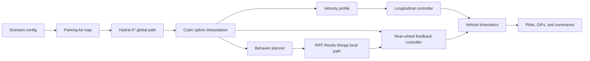

# Architecture

This repository is organized around the path-velocity-control pipeline from the thesis.



## Scenario Configuration

Scenario wrappers in `scenarios/` load compact JSON files from `scenarios/configs/`.
The wrappers exist only to provide stable Python entry points for the runner.

Use JSON configs for normal parameter changes:

- start and goal poses,
- target speeds,
- lead-vehicle initial speed,
- parking-lot obstacle-map options,
- behavior thresholds for lane-change scenarios.

Create a new Python scenario only when the behavior loop itself changes.

## Map And Path Setup

`simulation.parking_lot_map` builds the obstacle points used by the planners.
`simulation.path_setup.prepare_hybrid_path` then runs Hybrid A* and computes spline curvature for tracking.

Hybrid A* produces a geometric path. The cubic spline module in `motion_planning/path_interpolation/` is used to interpolate that path and sample curvature; it is not a full trajectory optimizer.

## Behavior And Local Planning

The behavior planner in `motion_planning/local_planning/behaviour_and_local_planner.py` monitors the lead vehicle and moves through a finite-state machine:

1. follow the original lane,
2. decide whether a lane change is needed,
3. generate an RRT Reeds-Shepp local path,
4. follow the adjacent lane,
5. generate a return lane-change path,
6. follow the original lane again.

The RRT path is local: it bridges from the current vehicle pose to a point on another Hybrid A* reference path.

## Velocity And Control

`motion_planning.velocity_planning` builds target-speed profiles for static, lead-following, and lane-change cases.

The controller layer is split into:

- `vehicle.controllers.longitudinal_pid_control`: saturated proportional speed control,
- `vehicle.controllers.rear_wheel_feedback_control`: lateral tracking control,
- `vehicle.kinematics.update`: bicycle-model state update.

The rear-wheel feedback controller keeps the thesis formulation, with named
default gains in `vehicle.controllers`: `kth = 1.0` for heading-error damping
and `ke = 0.7` for lateral-error correction. The lower lateral gain was chosen
to reduce steering chatter after local RRT lane changes while preserving stable
straight-line tracking.

## Outputs

Use `outputs/` for local generated artifacts. Curated README media lives in `docs/figures/`.

Regenerate the README media with:

```powershell
python scripts\generate_readme_media.py
```
